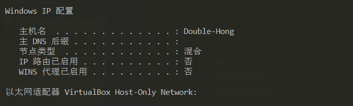
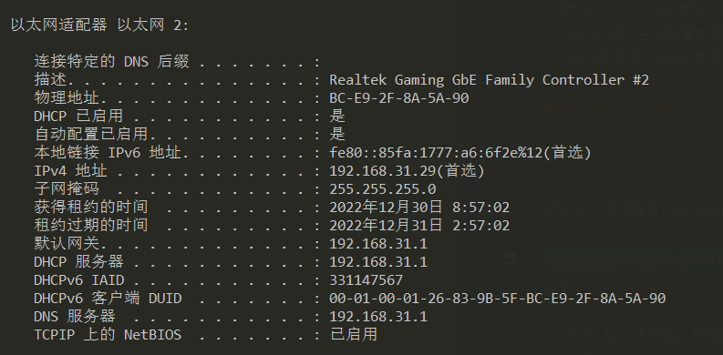
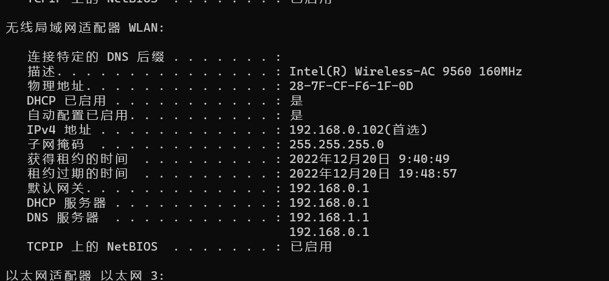
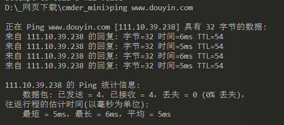

# 计算机网络实验报告  

---

## 目录  
- [验证性实验](#验证性实验)  
  - [ipconfig](#ipconfig)  
  - [ping](#ping)

  

## 验证性实验  
   
### ipconfig
`ipconfig`是微软操作系统的计算机上用来控制网络连接的一个命令行工具。它的主要用来显示当前网络连接的配置信息（`/all` 参数）。
#### 实作一  
使用 `ipconfig/all` 查看自己计算机的网络配置，尽可能明白每行的意思，特别注意 **IP** 地址、子网掩码 **Subnet Mask**、网关 **Gateway**。  

  

  
IPv4 地址:`192.168.31.1`就是本机所分配到的IP地址  
子网掩码:子网掩码是一个32位地址，用于屏蔽IP地址的一部分以区别网络标识和主机标识，并说明该IP地址是在局域网上，还是在广域网上。本机的子网掩码为:`255.255.255.0`  
网关:本机的默认网关是`192.168.31.1`。默认网关是子网与外网连接的设备，通常是一个路由器。它的地址通常是一个子网下的第一个地址。  
  
#### 实作二  
使用 `ipconfig/all` 查看**旁边**计算机的网络配置，看看有什么异同。  
  
这是在另一台计算机上运行`ipconfig/all`的结果（条件有限旁边没有其它计算机，是同学家的计算机）。  
可以看到这台计算机上的数据与本机不同，IP、子网掩码、网关都与本机**不同**，与本机不在同一子网下。  
  
***
  
### ping  
`PING` （Packet Internet Groper），因特网包探索器，用于测试网络连接量的程序 。`PING` 是工作在 `TCP/IP` 网络体系结构中应用层的一个服务命令， 主要是向特定的目的主机发送 ICMP（Internet Control Message Protocol 因特网报文控制协议）Echo 请求报文，测试目的站是否可达及了解其有关状态。  
#### 实作一  
测试本机到抖音官网的连通性  
`ping www.douyin.com`  
  
抖音官网返回的数据有**字节、时间、TTL**  
- **字节**：字节=32表示抖音官网回复的数据包大小为`32个字节`  
- **时间**：表示与主机往返一次所耗时间为`6ms（5ms）`  
- **TTL**:`TTL`全称`Time To Live`，意为**生存时间**，也就是该IP包的**生存周期**。
IP包在从目标网站传回本机时，每路过一个路由器，它的TTL就会减一，当TTL为0时，会抛弃此IP包。

