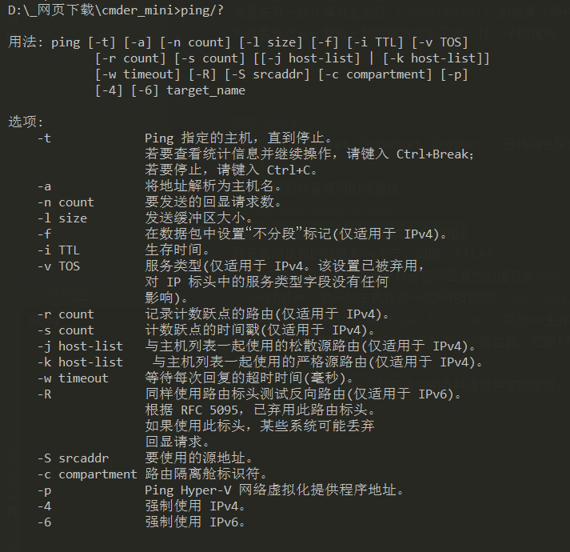
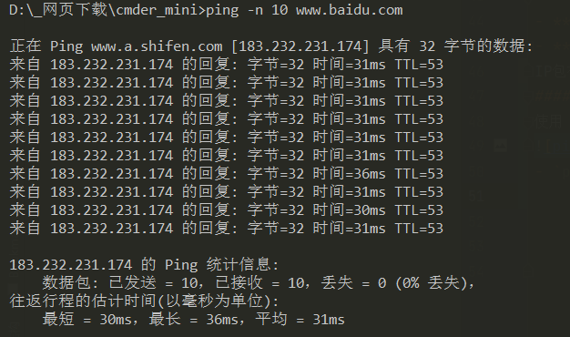
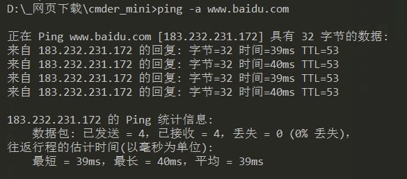
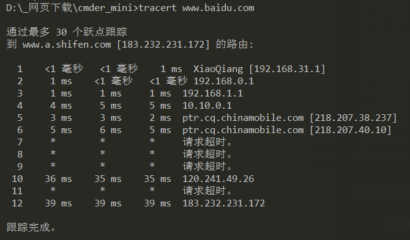
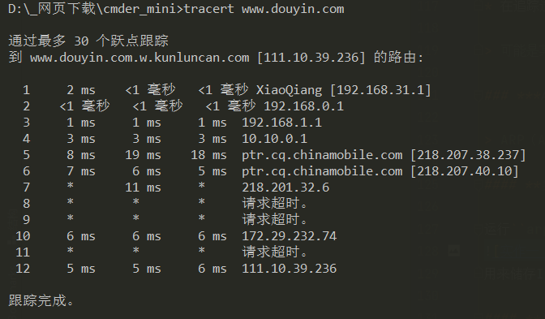
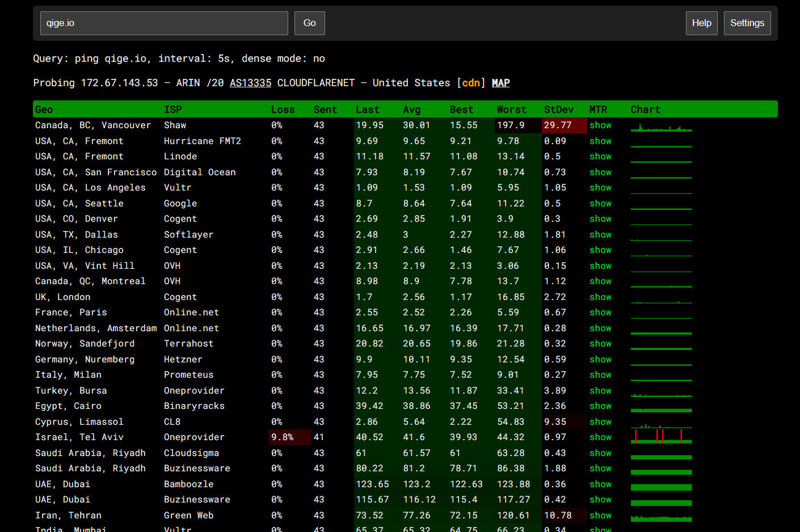
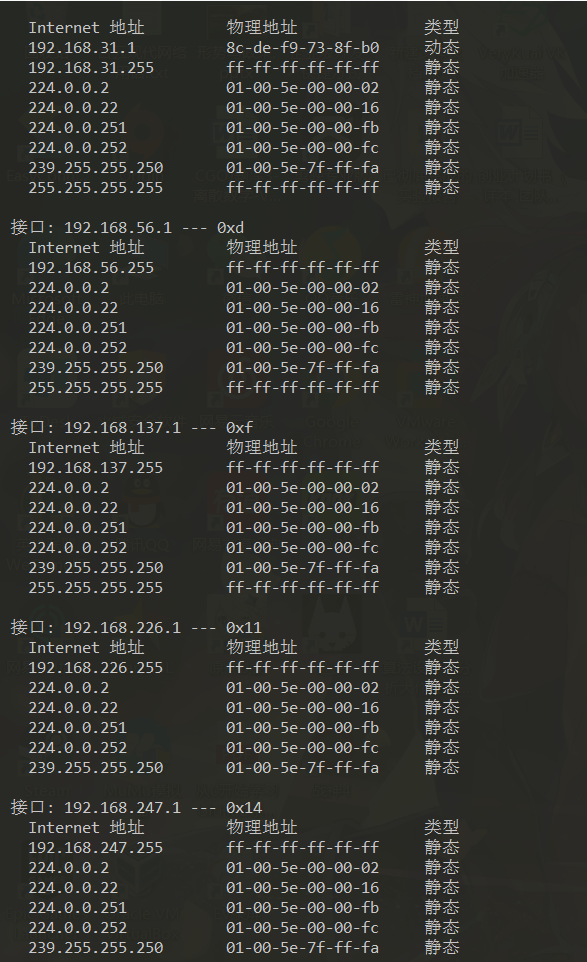
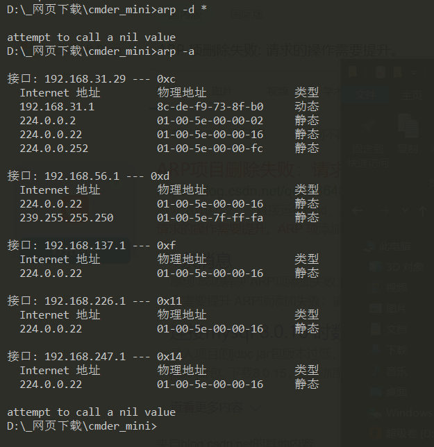

# 计算机网络实验报告  

---

## 目录  
- [验证性实验](#验证性实验)  
  - [ipconfig](#ipconfig)  
  - [ping](#ping)  
  - [tracert](#tracert)

  

## 验证性实验  
   
### ipconfig
`ipconfig`是微软操作系统的计算机上用来控制网络连接的一个命令行工具。它的主要用来显示当前网络连接的配置信息（`/all` 参数）。
#### 实作一  
使用 `ipconfig/all` 查看自己计算机的网络配置，尽可能明白每行的意思，特别注意 **IP** 地址、子网掩码 **Subnet Mask**、网关 **Gateway**。  

  

  
- IPv4 地址:`192.168.31.1`就是本机所分配到的IP地址  
- 子网掩码:子网掩码是一个32位地址，用于屏蔽IP地址的一部分以区别网络标识和主机标识，并说明该IP地址是在局域网上，还是在广域网上。本机的子网掩码为:`255.255.255.0`  
- 网关:本机的默认网关是`192.168.31.1`。默认网关是子网与外网连接的设备，通常是一个路由器。它的地址通常是一个子网下的第一个地址。  
  
#### 实作二  
使用 `ipconfig/all` 查看**旁边**计算机的网络配置，看看有什么异同。  
  
这是在另一台计算机上运行`ipconfig/all`的结果（条件有限旁边没有其它计算机，是同学家的计算机）。  
可以看到这台计算机上的数据与本机不同，IP、子网掩码、网关都与本机**不同**，与本机不在同一子网下。  
  
***
  
### ping  
`PING` （Packet Internet Groper），因特网包探索器，用于测试网络连接量的程序 。`PING` 是工作在 `TCP/IP` 网络体系结构中应用层的一个服务命令， 主要是向特定的目的主机发送 ICMP（Internet Control Message Protocol 因特网报文控制协议）Echo 请求报文，测试目的站是否可达及了解其有关状态。  
#### 实作一  
测试本机到**抖音官网**的连通性  
`ping www.douyin.com`  
  
抖音官网返回的数据有**字节、时间、TTL**  
- **字节**：字节=32表示抖音官网回复的数据包大小为`32个字节`  
- **时间**：表示与主机往返一次所耗时间为`6ms（5ms）`  
- **TTL**:`TTL`全称`Time To Live`，意为**生存时间**，也就是该IP包的**生存周期**。
IP包在从目标网站传回本机时，每路过一个路由器，它的TTL就会减一，当TTL为0时，会抛弃此IP包。  
#### 实作二  
使用 `ping/?` 命令了解该命令的各种选项并实际使用。  
  
- `ping -n 10 www.baidu.com`   
向百度发出请求，并让它返回**10条**回显请求。
  
- `ping -a www.baidu.com`  
ping -a 将**地址**解析为**主机名**
  
  
***  
  
### tracert  
`TRACERT` (Trace Route 的组合缩写)，也称为路由追踪，该命令行程序可用于跟踪 Internet 协议 （IP） 数据包传送到目标地址时经过的路径。  
#### 实作一  
了解本机到www.baidu.com中间经过了哪些节点（路由器）及其它状态,使用`tracert www.baidu.com`命令。  
  

从返回的数据分析：  
**最左边一列**的数字表示本机到baidu.com经历了12个节点  。
**中间三列**数字分别表示连接到**每个路由节点的速度**、**返回速度**、**多次链接反馈的平均值**。  
最右边的就是各个节点的**IP**  

在网站http://ip.cn上查看这些节点的位置。
- 192.168.31.1 内网IP 内网IP
- 192.168.0.1  内网IP 内网IP
- 192.168.1.1 内网IP 内网IP
- 10.10.0.1 内网IP 内网IP
- 218.207.38.237 中国 重庆 重庆市 移动
- 218.207.40.10 中国 重庆 重庆市 移动
- 120.241.49.26 中国 广东省 深圳市 移动
- 183.232.231.172 中国 广东省 广州市 移动  
使用`tracert www.douyin.com`跟踪抖音官网  
  
#### 实作二  
`ping.pe` 这个网站可以探测从全球主要的 ISP 到某站点如 https://qige.io 的线路状态，当然也包括各线路到该主机的路由情况。  
  
> 在以上两个实作中，如果你留意路径中的节点，你会发现无论是访问百度还是棋歌教学网，路径中的第一跳都是相同的，甚至你应该发现似乎前几个节点都是相同的，你的解释是什么？  
  
我们在追踪某站点时，tracert会记录我们经过的节点，不论是访问百度还是棋歌教学网，都需要经过本机当前局域网的交换机，也就是默认网关，这样数据包才能从这里发送出去。  
> 在追踪过程中，为什么路径中某些节点显示为 * 号？  
  
*号的节点表示这些节点和我们当前使用的宽带是无法联通的，可能的原因是这些节点设置了不可ping和tracert或者做了过滤限制。  
  
***  
  
### ARP  
`ARP`（Address Resolution Protocol）即地址解析协议，是用于根据给定网络层地址即 IP 地址，查找并得到其对应的数据链路层地址即**MAC地址**的协议。  
#### 实作一  
运行 `arp -a` 命令查看当前的 arp 缓存， 请留意缓存了些什么。  

缓存了一下IP地址下所对应的MAC物理地址  
使用 `arp -d *` 删除全部缓存，再次查看缓存  

