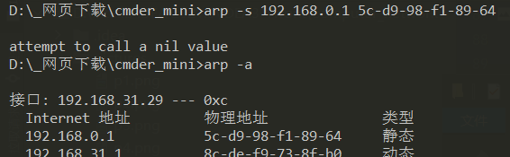
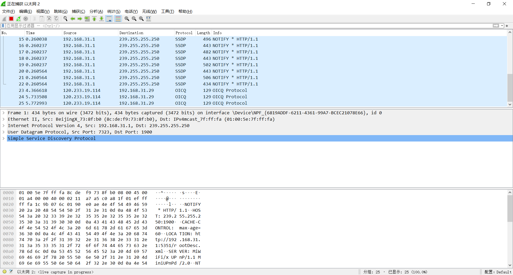
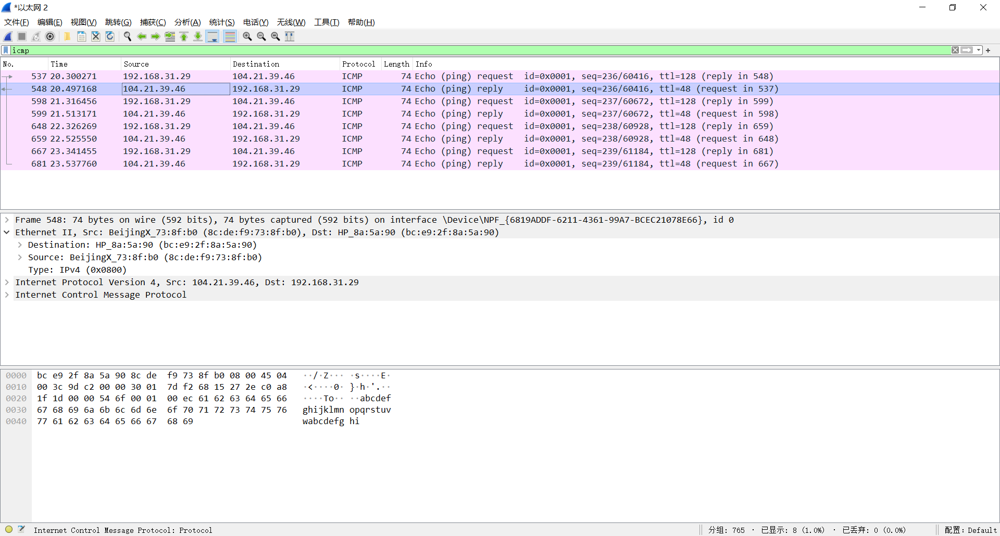

# 计算机网络实验报告  

---

## 目录  
- [验证性实验](#验证性实验)  
  - [ipconfig](#ipconfig)  
  - [ping](#ping)  
  - [tracert](#tracert)
  - [DHCP](#DHCP)
  - [netstat](#netstat)
  - [DNS](#DNS)
  - [cache](#cache)
- [Wireshark 实验](#Wireshark实验)
  - [数据链路层](#数据链路层)
  - [网络层](#网络层)
  - [传输层](#传输层)
  - [应用层](#应用层)

  

## 验证性实验  
   
### ipconfig
`ipconfig`是微软操作系统的计算机上用来控制网络连接的一个命令行工具。它的主要用来显示当前网络连接的配置信息（`/all` 参数）。
#### 实作一  
使用 `ipconfig/all` 查看自己计算机的网络配置，尽可能明白每行的意思，特别注意 **IP** 地址、子网掩码 **Subnet Mask**、网关 **Gateway**。  

  

  
- IPv4 地址:`192.168.31.1`就是本机所分配到的IP地址  
- 子网掩码:子网掩码是一个32位地址，用于屏蔽IP地址的一部分以区别网络标识和主机标识，并说明该IP地址是在局域网上，还是在广域网上。本机的子网掩码为:`255.255.255.0`  
- 网关:本机的默认网关是`192.168.31.1`。默认网关是子网与外网连接的设备，通常是一个路由器。它的地址通常是一个子网下的第一个地址。  
  
#### 实作二  
使用 `ipconfig/all` 查看**旁边**计算机的网络配置，看看有什么异同。  
  
这是在另一台计算机上运行`ipconfig/all`的结果（条件有限旁边没有其它计算机，是同学家的计算机）。  
可以看到这台计算机上的数据与本机不同，IP、子网掩码、网关都与本机**不同**，与本机不在同一子网下。  
  
***
  
### ping  
`PING` （Packet Internet Groper），因特网包探索器，用于测试网络连接量的程序 。`PING` 是工作在 `TCP/IP` 网络体系结构中应用层的一个服务命令， 主要是向特定的目的主机发送 ICMP（Internet Control Message Protocol 因特网报文控制协议）Echo 请求报文，测试目的站是否可达及了解其有关状态。  
#### 实作一  
测试本机到**抖音官网**的连通性  
`ping www.douyin.com`  
  
抖音官网返回的数据有**字节、时间、TTL**  
- **字节**：字节=32表示抖音官网回复的数据包大小为`32个字节`  
- **时间**：表示与主机往返一次所耗时间为`6ms（5ms）`  
- **TTL**:`TTL`全称`Time To Live`，意为**生存时间**，也就是该IP包的**生存周期**。
IP包在从目标网站传回本机时，每路过一个路由器，它的TTL就会减一，当TTL为0时，会抛弃此IP包。  
#### 实作二  
使用 `ping/?` 命令了解该命令的各种选项并实际使用。  
  
- `ping -n 10 www.baidu.com`   
向百度发出请求，并让它返回**10条**回显请求。  

  

- `ping -a www.baidu.com`  
ping -a 将**地址**解析为**主机名**  

  
  
***  
  
### tracert  
`TRACERT` (Trace Route 的组合缩写)，也称为路由追踪，该命令行程序可用于跟踪 Internet 协议 （IP） 数据包传送到目标地址时经过的路径。  
#### 实作一  
了解本机到www.baidu.com中间经过了哪些节点（路由器）及其它状态,使用`tracert www.baidu.com`命令。  
  

从返回的数据分析：  
**最左边一列**的数字表示本机到baidu.com经历了12个节点  。
**中间三列**数字分别表示连接到**每个路由节点的速度**、**返回速度**、**多次链接反馈的平均值**。  
最右边的就是各个节点的**IP**  

在网站http://ip.cn上查看这些节点的位置。
- 192.168.31.1 内网IP 内网IP
- 192.168.0.1  内网IP 内网IP
- 192.168.1.1 内网IP 内网IP
- 10.10.0.1 内网IP 内网IP
- 218.207.38.237 中国 重庆 重庆市 移动
- 218.207.40.10 中国 重庆 重庆市 移动
- 120.241.49.26 中国 广东省 深圳市 移动
- 183.232.231.172 中国 广东省 广州市 移动  
使用`tracert www.douyin.com`跟踪抖音官网  
  
#### 实作二  
`ping.pe` 这个网站可以探测从全球主要的 ISP 到某站点如 https://qige.io 的线路状态，当然也包括各线路到该主机的路由情况。  
  
> 在以上两个实作中，如果你留意路径中的节点，你会发现无论是访问百度还是棋歌教学网，路径中的第一跳都是相同的，甚至你应该发现似乎前几个节点都是相同的，你的解释是什么？  
  
我们在追踪某站点时，tracert会记录我们经过的节点，不论是访问百度还是棋歌教学网，都需要经过本机当前局域网的交换机，也就是默认网关，这样数据包才能从这里发送出去。  
> 在追踪过程中，为什么路径中某些节点显示为 * 号？  
  
*号的节点表示这些节点和我们当前使用的宽带是无法联通的，可能的原因是这些节点设置了不可ping和tracert或者做了过滤限制。  
  
***  
  
### ARP  
`ARP`（Address Resolution Protocol）即地址解析协议，是用于根据给定网络层地址即 IP 地址，查找并得到其对应的数据链路层地址即**MAC地址**的协议。  
#### 实作一  
运行 `arp -a` 命令查看当前的 arp 缓存， 请留意缓存了些什么。  
  

缓存了一下IP地址下所对应的MAC物理地址  
使用 `arp -d *` 删除全部缓存，再次查看缓存  
  
运行`arp -d *`后，本机与其他IP地址的一些物理地址的缓存记录被清除了。被清除的应该是本机最近访问到的节点的地址。
#### 实作二  
使用 `arp /?` 命令了解该命令的各种选项。
  
#### 实作三  
假设当前网关的 IP 地址是 `192.168.0.1`，MAC 地址是 `5c-d9-98-f1-89-64`，请使用 `arp -s 192.168.0.1 5c-d9-98-f1-89-64` 命令设置其为静态类型的。
  
第一次输入`arp -s 192.168.0.1 5c-d9-98-f1-89-64`失败，需要以管理员身份运行。  
  
以管理员身份运行cmder后成功，可以看到已经将192.168.0.1的物理地址添加到了arp缓存中。  
> 我们将网关或其它计算机的 arp 信息设置为静态有什么优缺点？  

配置静态ARP表项可以增加通信的安全性。静态ARP表项可以限制和指定IP地址的设备通信时只使用指定的MAC地址，此时攻击报文无法修改此表项的IP地址和MAC地址的映射关系，从而保护了本设备和指定设备间的正常通信。  
  
***  
  
### DHCP  
DHCP（Dynamic Host Configuration Protocol）即动态主机配置协议，是一个用于 IP 网络的网络协议，位于 OSI 模型的应用层，使用 UDP 协议工作，主要有两个用途：

- 用于内部网或网络服务供应商自动分配 IP 地址给用户
- 用于内部网管理员对所有电脑作中央管理  

简单的说，DHCP 可以让计算机自动获取/释放网络配置。  
    
#### 实作一  
使用 `ipconfig/release` 命令释放自动获取的网络配置，并用 `ipconfig/renew` 命令重新获取。  
  
  
使用`ipconfig/renew`后本机重新获取了IP。  
  
***  
  
### netstat  
无论是使用 TCP 还是 UDP，任何一个网络服务都与特定的端口（Port Number）关联在一起。因此，每个端口都对应于某个通信协议/服务。

`netstat`（Network Statistics）是在内核中访问网络连接状态及其相关信息的命令行程序，可以显示路由表、实际的网络连接和网络接口设备的状态信息，以及与 IP、TCP、UDP 和 ICMP 协议相关的统计数据，一般用于检验本机各端口的网络服务运行状况。
  
#### 实作一  
Windows 系统将一些常用的端口与服务记录在 `C:\WINDOWS\system32\drivers\etc\services` 文件中，请查看该文件了解常用的端口号分配。  
  
#### 实作二  
使用 `netstat -an` 命令，查看计算机当前的网络连接状况。  
  
  
***  
  
### DNS  
`DNS`（Domain Name System）即域名系统，是互联网的一项服务。它作为将域名和 IP 地址相互映射的一个分布式数据库，能够使人更方便地访问互联网。DNS 使用 TCP 和 UDP 的 53 号端口。  
#### 实作一  
Windows 系统将一些固定的/静态的 DNS 信息记录在 `C:\WINDOWS\system32\drivers\etc\hosts` 文件中，如我们常用的 `localhost` 就对应 `127.0.0.1` 。  
  
#### 实作二  
解析过的 **DNS** 记录将会被缓存，以利于加快解析速度。使用 `ipconfig /displaydns` 命令查看。我们也可以使用 `ipconfig /flushdns` 命令来清除所有的 DNS 缓存。  
  
使用`ipconfig /displaydns`后，显示了DNS解析器缓存的内容，包括了很多从本地Hosts文件预装载的记录以及由域名解析服务器解析的所有资源记录。  
  
#### 实作三  
使用 `nslookup qige.io` 命令，将使用默认的 DNS 服务器查询该域名。  
  
  
***  
  
### cache  
`cache` 即缓存，是 IT 领域一个重要的技术。我们此处提到的 cache 主要是浏览器缓存。

浏览器缓存是根据 HTTP 报文的缓存标识进行的，是性能优化中简单高效的一种优化方式了。一个优秀的缓存策略可以缩短网页请求资源的距离，减少延迟，并且由于缓存文件可以重复利用，还可以减少带宽，降低网络负荷。  
#### 实作一  
打开 Chrome 或 Firefox 浏览器，访问 https://qige.io ，接下来敲 F12 键 或 Ctrl + Shift + I 组合键打开开发者工具，选择 Network 面板后刷新页面。  
  
可以看到加载该页面花费了296ms。  
在该页面显示的列表下，看到Size列下有`memory cache`和`disk cache`两种字样。  
memory cache 就是内存中的缓存，读取速度很快，但是只要我们关闭了页面，内存中的缓存就被释放了。  
disk cache 就是存储在硬盘中的缓存，disk cache生存的时间会比memory cache更长。  
#### 实作二  
接下来仍在 Network 面板，选择 `Disable cache` 选项框，表明当前不使用 cache，页面数据全部来自于 Internet，刷新页面，再次在开发者工具底部查看加载该页面花费的时间。  
  
在选择 `Disable cache` 后重新刷新了页面，这次加载这个页面所用的时间变为了1.47s，明显比使用缓存时所花费的时间要多。  
  
***  
***  
  
## Wireshark实验  
  
***  
  
### 数据链路层  
#### 实作一 熟悉 Ethernet 帧结构  
使用 Wireshark 任意进行抓包，熟悉 Ethernet 帧的结构，如：目的 MAC、源 MAC、类型、字段等。  
    
  
对本机当前网络环境任意进行抓包。  
由图中可以得出：  
- Destination:目的MAC地址`8c:de:f9:73:8f:b0`  
- Source:源MAC地址`bc:e9:2f:8a:5a:90`  
- Type:类型  
> 你会发现 Wireshark 展现给我们的帧中没有校验字段，请了解一下原因。  
  
Wireshark默认关掉校验，把校验字段过滤了。  
#### 实作二 了解子网内/外通信时的 MAC 地址  
1. `ping qige.io` （或者本子网外的主机都可以），同时用 Wireshark 抓这些包（可 icmp 过滤），记录一下发出帧的目的 MAC 地址以及返回帧的源 MAC 地址是多少？这个 MAC 地址是谁的？  
  
- 发出帧的目的MAC地址：`8c:de:f9:73:8f:b0`  
- 返回帧的源MAC地址：`8c:de:f9:73:8f:b0`  
可以看到两个MAC地址相同，一个是发送过去时的目的地址，一个是回复本机时的源地址。这个 MAC 地址应该是我的主机所处子网的网关MAC地址。  
2. 再次 `ping www.cqjtu.edu.cn` （或者本子网外的主机都可以），同时用 Wireshark 抓这些包（可 icmp 过滤），记录一下发出帧的目的 MAC 地址以及返回帧的源 MAC 地址又是多少？这个 MAC 地址又是谁的？  
  
- 发出帧的目的MAC地址：`8c:de:f9:73:8f:b0`
- 返回帧的源MAC地址：`8c:de:f9:73:8f:b0`   
也是相同的，是我的主机所处子网的网关MAC地址。  
> 通过以上的实验，你会发现：  
> 访问本子网的计算机时，目的 MAC 就是该主机的  
> 访问非本子网的计算机时，目的 MAC 是网关的  
> 请问原因是什么？    

因为在子网之内的计算机不需要经过网关，可以直接查询MAC地址并建立连接。  
而访问子网外的需要先将数据发送到网关处，然后ARP或者DNS解析得到MAC地址后到达目的子网发送到目的地址，所以无论是发送还是接受都要经过本计算机的网关。  
#### 实作三 掌握 ARP 解析过程  
1. 为防止干扰，先使用 `arp -d *` 命令清空 arp 缓存    
  
2. `ping` 你旁边的计算机（同一子网），同时用 Wireshark 抓这些包（可 arp 过滤），查看 ARP 请求的格式以及请求的内容，注意观察该请求的目的 MAC 地址是什么。再查看一下该请求的回应，注意观察该回应的源 MAC 和目的 MAC 地址是什么。  
  
这里ping的是自己的手机。  
目的MAC地址是`ff:ff:ff:ff:ff:ff`，是广播地址。
3. 再次使用 `arp -d *` 命令清空 arp 缓存  
4. 然后 `ping qige.io` （或者本子网外的主机都可以），同时用 Wireshark 抓这些包（可 arp 过滤）。查看这次 ARP 请求的是什么，注意观察该请求是谁在回应。  
  
   ARP 请求的是ff ff ff ff ff ff。访问的非本子网的 IP， 所以回应的是网关的 MAC地址。  
> 通过以上的实验，你应该会发现，
> 1. ARP 请求都是使用广播方式发送的  
> 2. 如果访问的是本子网的 IP，那么 ARP 解析将直接得到该 IP 对应的 MAC；如果访问的非本子网的 IP， 那么 ARP 解析将得到网关的 MAC。     
> 
> 请问为什么？  
- 因为我们先使用了`arp -d *`清除了arp上的缓存，在ping另一台主机时，我们主机本地的arp缓存中没有对应的MAC地址，所以先通过广播的方式寻找MAC地址。  
- 访问子网内的IP不需要经过网关，所以直接得到该IP对应的MAC地址，访问子网外的IP必须经过网关，所以得到的是网关的MAC地址。  
  
***  
  
### 网络层
#### 实作一 熟悉 IP 包结构  
使用 Wireshark 任意进行抓包（可用 `ip` 过滤），熟悉 IP 包的结构，如：`版本`、`头部长度`、`总长度`、`TTL`、`协议类型`等字段。  
  
- Version:4 版号为4
- Header Length:20bytes 头长20字节
- Total Length:71 总长度71
- Time to live:128 生存周期128
> 为提高效率，我们应该让 IP 的头部尽可能地精简。但在如此珍贵的 IP 头部你会发现既有头部长度字段，也有总长度字段。请问为什么？  
  
1. IP包头长度的作用是为了描述IP包头的长度，因为在IP包头中有变长的可选部分。提供包头长度，使接收方知道该IP包从哪里开始读取数据。
2. IP包总长,记录了该IP包包括头部和数据的总长，它的作用是使接收方知道在何处停止读取数据。  
  
#### 实作二  IP 包的分段与重组  
根据规定，一个 IP 包最大可以有 **64K** 字节。但由于 Ethernet 帧的限制，当 IP 包的数据超过 1500 字节时就会被发送方的数据链路层分段，然后在接收方的网络层重组。

缺省的，ping 命令只会向对方发送 32 个字节的数据。我们可以使用 `ping 202.202.240.16 -l 2000` 命令指定要发送的数据长度。此时使用 Wireshark 抓包（用 `ip.addr == 202.202.240.16` 进行过滤），了解 IP 包如何进行分段，如：分段标志、偏移量以及每个包的大小等。  
  
  
可以看到第一条信息和第二条信息是同一个源发出去的，应该是同一个IP包。  
第一个的总长是1500，第二个的总长是548.
> 分段与重组是一个耗费资源的操作，特别是当分段由传送路径上的节点即路由器来完成的时候，所以 IPv6 已经不允许分段了。那么 IPv6 中，如果路由器遇到了一个大数据包该怎么办？  
  
在IPv6中，如果路由器遇到了大数据包，则会将此数据包丢弃，并告诉发送方这个数据包太大，通过其他手段分段后再发送过来。  
#### 实作三 考察 TTL 事件  
在 IP 包头中有一个 TTL 字段用来限定该包可以在 Internet上传输多少跳（hops），一般该值设置为 64、128等。

在验证性实验部分我们使用了 `tracert` 命令进行路由追踪。其原理是主动设置 IP 包的 TTL 值，从 1 开始逐渐增加，直至到达最终目的主机。

请使用 `tracert www.baidu.com` 命令进行追踪，此时使用 Wireshark 抓包（用 `icmp` 过滤），分析每个发送包的 TTL 是如何进行改变的，从而理解路由追踪原理。  
  
  
tracert发送的数据包的TTL依次在增大。  
> 在 IPv4 中，TTL 虽然定义为生命期即 Time To Live，但现实中我们都以跳数/节点数进行设置。如果你收到一个包，其 TTL 的值为 50，那么可以推断这个包从源点到你之间有多少跳？  

TTL的值每一跳-1，当我收到一个包的TTL=50时，则128-50=78/64-50=14，说明经过了78/14跳。  
  
***  
  
### 传输层  
#### 实作一 熟悉 TCP 和 UDP 段结构  
1. 用 Wireshark 任意抓包（可用 `tcp` 过滤），熟悉 TCP 段的结构，如：源端口、目的端口、序列号、确认号、各种标志位等字段。  
  
此条TCP段中，`ec 99`是源端口号，`00 50`是目的端口号，`2a 11 f5 0b`是序号，再往后四个字节是确认号，总共20个字节固定首部。
2. 用 Wireshark 任意抓包（可用 udp 过滤），熟悉 UDP 段的结构，如：源端口、目的端口、长度等。  
  
UDP段中，第三和第四字节是源端口，第五第六字节是目的端口，第七第八字节是长度。  
> 由上大家可以看到 UDP 的头部比 TCP 简单得多，但两者都有源和目的端口号。请问源和目的端口号用来干什么？ 
  
- TCP的源端口号：标识发送报文的计算机端口或进程。
- TCP的目的端口号：标识接收报文的目的主机的端口或进程。
- UDP的源端口号是发送方端口号。
- UDP的目的端口号是接收方端口号。
#### 实作二 分析 TCP 建立和释放连接  
1. 打开浏览器访问 qige.io 网站，用 Wireshark 抓包（可用 tcp 过滤后再使用加上 Follow TCP Stream），不要立即停止 Wireshark 捕获，待页面显示完毕后再多等一段时间使得能够捕获释放连接的包。

2. 请在你捕获的包中找到三次握手建立连接的包，并说明为何它们是用于建立连接的，有什么特征。  
- 第一次握手：SYN=1,ACK=0
- 第二次握手：SYN=1,ACK=1
- 第三次握手：SYN=0,ACK=1  
  
***  
  
### 应用层  
#### 实作一 了解 DNS 解析  
1. 先使用 `ipconfig /flushdns` 命令清除缓存，再使用 `nslookup qige.io` 命令进行解析，同时用 Wireshark 任意抓包（可用 dns 过滤）。

2. 你应该可以看到当前计算机使用 UDP，向默认的 DNS 服务器的 53 号端口发出了查询请求，而 DNS 服务器的 53 号端口返回了结果。

3. 可了解一下 DNS 查询和应答的相关字段的含义  
    
- QR：查询/应答标志。0表示这是一个查询报文，1表示这是一个应答报文
- opcode，定义查询和应答的类型。0表示标准查询，1表示反向查询（由IP地址获得主机域名），2表示请求服务器状态
- AA，授权应答标志，仅由应答报文使用。1表示域名服务器是授权服务器
- TC，截断标志，仅当DNS报文使用UDP服务时使用。因为UDP数据报有长度限制，所以过长的DNS报文将被截断。1表示DNS报文超过512字节，并被截断
> 你可能会发现对同一个站点，我们发出的 DNS 解析请求不止一个，思考一下是什么原因？  
  
为了降低服务器的负担，同一个域名可能对应多个IP。所以就会有多次DNS解析。  
#### 实作二 了解 HTTP 的请求和应答  
1. 打开浏览器访问 qige.io 网站，用 Wireshark 抓包（可用http 过滤再加上 `Follow TCP Stream`），不要立即停止 Wireshark 捕获，待页面显示完毕后再多等一段时间以将释放连接的包捕获。  

2. 请在你捕获的包中找到 HTTP 请求包，查看请求使用的什么命令，如：`GET`, `POST`。并仔细了解请求的头部有哪些字段及其意义。  
- Request Method:请求方法
- Request URL:请求的URL
- User-Agent:用户代理，包含发出请求的用户信息
- Connection:是否需要长连接
3. 请在你捕获的包中找到 HTTP 应答包，查看应答的代码是什么，如：`200`, `304`, `404` 等。并仔细了解应答的头部有哪些字段及其意义。
- 200：交易成功；
- 304：客户端已经执行了GET，但文件未变化；
- 404：没有发现文件、查询或URl；
